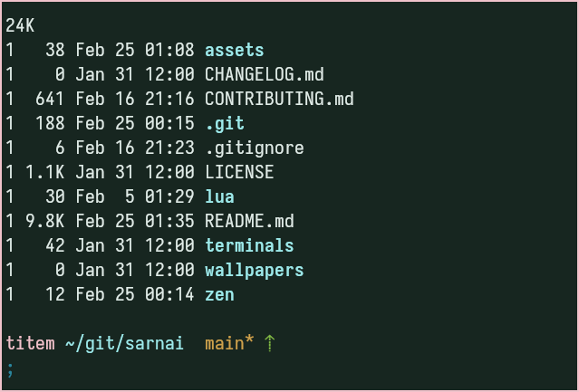
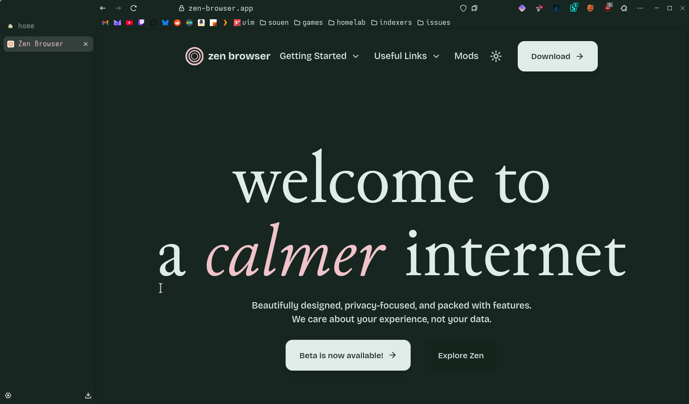

<h3 align="center">sarnai</h3>
<h6 align="center">ᠰᠠᠷᠠᠨᠠᠢ</h6>
<br/>
<p align="center">
  <a href="https://github.com/titembaatar/sarnai"></a>
  <a href="https://github.com/titembaatar/sarnai/blob/main/LICENSE"></a>
</p>

sarnai (ᠰᠠᠷᠠᠨᠠᠢ) means "rose" in Mongolian, my favourite colour, but most of all, the name of my beloved wife.
She's the one who made the logo, helped find colors name, refined the palette to be more authentic. 

## 🇲🇳 Philosophy  
- **Readability First**: Good contrast for clarity, but soft enough for long sessions.  
- **Minimalist Spirit**: Sticking with terminal 16 colors and some variants for bgs and fgs.  
- **Green Tints**: Because I love green, and I'm tired of blues.

## 🎨 Palette
<p align="center">
  
  
</p>

<details>
<summary>🌸 Хавар (Khavar) - Spring</summary>
<table>
  <tr>
    <th>Swatch</th>
    <th>Name</th>
    <th>Hex</th>
    <th>HSL</th>
  </tr>
  <tr>
    <td></td>
    <td>base</td>
    <td><code>#172620</code></td>
    <td><code>hsl(156, 24%, 11%)</code></td>
  </tr>
  <tr>
    <td></td>
    <td>surface</td>
    <td><code>#21362d</code></td>
    <td><code>hsl(154, 24%, 17%)</code></td>
  </tr>
  <tr>
    <td></td>
    <td>overlay</td>
    <td><code>#2d493d</code></td>
    <td><code>hsl(154, 23%, 23%)</code></td>
  </tr>
  <tr>
    <td></td>
    <td>muted</td>
    <td><code>#4e7e6b</code></td>
    <td><code>hsl(156, 23%, 40%)</code></td>
  </tr>
  <tr>
    <td></td>
    <td>subtle</td>
    <td><code>#90bbaa</code></td>
    <td><code>hsl(156, 24%, 64%)</code></td>
  </tr>
  <tr>
    <td></td>
    <td>text</td>
    <td><code>#dfece7</code></td>
    <td><code>hsl(156, 25%, 90%)</code></td>
  </tr>
  <tr>
    <td></td>
    <td>low</td>
    <td><code>#39ac7e</code></td>
    <td><code>hsl(156, 50%, 44%)</code></td>
  </tr>
  <tr>
    <td></td>
    <td>mid</td>
    <td><code>#2d8662</code></td>
    <td><code>hsl(155, 49%, 35%)</code></td>
  </tr>
  <tr>
    <td></td>
    <td>high</td>
    <td><code>#206046</code></td>
    <td><code>hsl(155, 50%, 25%)</code></td>
  </tr>
  <tr>
    <td></td>
    <td>sarnai<br>Сарнай<br>Rose</td>
    <td><code>#f0c3cb</code></td>
    <td><code>hsl(349, 60%, 85%)</code></td>
  </tr>
  <tr>
    <td></td>
    <td>anis<br>Аньс<br>Cowberry</td>
    <td><code>#ff6b6b</code></td>
    <td><code>hsl(0, 100%, 70%)</code></td>
  </tr>
  <tr>
    <td></td>
    <td>chatsalgan<br>Чацаргана<br>Hippophae</td>
    <td><code>#e5951a</code></td>
    <td><code>hsl(36, 79%, 50%)</code></td>
  </tr>
  <tr>
    <td></td>
    <td>els<br>Элс<br>Sand</td>
    <td><code>#cca24d</code></td>
    <td><code>hsl(40, 55%, 55%)</code></td>
  </tr>
  <tr>
    <td></td>
    <td>uvs<br>Өвс<br>Grass</td>
    <td><code>#80b946</code></td>
    <td><code>hsl(89, 45%, 50%)</code></td>
  </tr>
  <tr>
    <td></td>
    <td>nuur<br>Нуур<br>Lake</td>
    <td><code>#2b879e</code></td>
    <td><code>hsl(192, 57%, 39%)</code></td>
  </tr>
  <tr>
    <td></td>
    <td>mus<br>Мөс<br>Ice</td>
    <td><code>#9deaea</code></td>
    <td><code>hsl(180, 64%, 76%)</code></td>
  </tr>
  <tr>
    <td></td>
    <td>yargui<br>Яргуй<br>Pasqueflower</td>
    <td><code>#d5b3e5</code></td>
    <td><code>hsl(280, 49%, 80%)</code></td>
  </tr>
</table>
</details>

<details>
<summary>❄️ Өвөл (Ovol) - Winter</summary>
<table>
  <tr>
    <th>Swatch</th>
    <th>Name</th>
    <th>Hex</th>
    <th>HSL</th>
  </tr>
  <tr>
    <td></td>
    <td>base</td>
    <td><code>#dceae4</code></td>
    <td><code>hsl(154, 24%, 89%)</code></td>
  </tr>
  <tr>
    <td></td>
    <td>surface</td>
    <td><code>#b6d2c7</code></td>
    <td><code>hsl(156, 23%, 76%)</code></td>
  </tr>
  <tr>
    <td></td>
    <td>overlay</td>
    <td><code>#90bbaa</code></td>
    <td><code>hsl(156, 24%, 64%)</code></td>
  </tr>
  <tr>
    <td></td>
    <td>muted</td>
    <td><code>#81b19e</code></td>
    <td><code>hsl(156, 23%, 60%)</code></td>
  </tr>
  <tr>
    <td></td>
    <td>subtle</td>
    <td><code>#446f5e</code></td>
    <td><code>hsl(156, 24%, 35%)</code></td>
  </tr>
  <tr>
    <td></td>
    <td>text</td>
    <td><code>#13201b</code></td>
    <td><code>hsl(156, 25%, 10%)</code></td>
  </tr>
  <tr>
    <td></td>
    <td>low</td>
    <td><code>#206046</code></td>
    <td><code>hsl(155, 50%, 25%)</code></td>
  </tr>
  <tr>
    <td></td>
    <td>mid</td>
    <td><code>#2d8662</code></td>
    <td><code>hsl(155, 49%, 35%)</code></td>
  </tr>
  <tr>
    <td></td>
    <td>high</td>
    <td><code>#39ac7e</code></td>
    <td><code>hsl(156, 50%, 44%)</code></td>
  </tr>
  <tr>
    <td></td>
    <td>sarnai<br>Сарнай<br>Rose</td>
    <td><code>#b93d4d</code></td>
    <td><code>hsl(352, 50%, 48%)</code></td>
  </tr>
  <tr>
    <td></td>
    <td>anis<br>Аньс<br>Cowberry</td>
    <td><code>#cc2929</code></td>
    <td><code>hsl(0, 66%, 48%)</code></td>
  </tr>
  <tr>
    <td></td>
    <td>chatsalgan<br>Чацаргана<br>Hippophae</td>
    <td><code>#da730c</code></td>
    <td><code>hsl(30, 89%, 45%)</code></td>
  </tr>
  <tr>
    <td></td>
    <td>els<br>Элс<br>Sand</td>
    <td><code>#df9b23</code></td>
    <td><code>hsl(38, 74%, 50%)</code></td>
  </tr>
  <tr>
    <td></td>
    <td>uvs<br>Өвс<br>Grass</td>
    <td><code>#4c890f</code></td>
    <td><code>hsl(90, 80%, 29%)</code></td>
  </tr>
  <tr>
    <td></td>
    <td>nuur<br>Нуур<br>Lake</td>
    <td><code>#0a728c</code></td>
    <td><code>hsl(192, 86%, 29%)</code></td>
  </tr>
  <tr>
    <td></td>
    <td>mus<br>Мөс<br>Ice</td>
    <td><code>#12adad</code></td>
    <td><code>hsl(180, 81%, 37%)</code></td>
  </tr>
  <tr>
    <td></td>
    <td>yargui<br>Яргуй<br>Pasqueflower</td>
    <td><code>#a353c6</code></td>
    <td><code>hsl(281, 50%, 55%)</code></td>
  </tr>
</table>
</details>

---

## 📦 Quick Start  

### Neovim
Available at: [sarnai.nvim](https://github.com/titembaatar/sarnai.nvim)

### Terminals  
Copy the config files from terminals/ to your terminal’s config directory.

#### Kitty
```bash
mkdir -p ~/.config/kitty/themes/
cp -r terminals/kitty/* ~/.config/kitty/themes/
```
Then, update your `kitty.conf`:
```conf
include ./themes/sarnai-khavar.conf
```

<p align="center">
  
</p>
<h4 align="center">Kitty Sarnai Khavar</h4>

#### Alacritty
```bash
mkdir -p ~/.config/alacritty/themes/
cp -r terminals/alacritty/* ~/.config/alacritty/themes/
```
Then, update your `alacritty.toml`:
```toml
[general]
import = ["~/.config/alacritty/themes/sarnai-khavar.toml"]
```

#### Ghostty
```bash
mkdir -p ~/.config/ghostty/themes/
cp -r terminals/ghostty/* ~/.config/ghostty/themes/
```
Then, update your `config`:
```
theme = sarnai-khavar
```

### Zen Browser
Copy `zen/chrome` to your [zen's profiles `chrome` folder](https://www.userchrome.org/how-create-userchrome-css.html). And add the [sarnai firefox theme](https://addons.mozilla.org/en-US/firefox/addon/sarnai)
<p align="center">
  
</p>
<h4 align="center">Zen Browser</h4>

### userStyles
To use with browser extension **Stylus** ([Firefox](https://addons.mozilla.org/en-US/firefox/addon/styl-us/) or [Chrome](https://chromewebstore.google.com/detail/stylus/clngdbkpkpeebahjckkjfobafhncgmne)).
Download the [import.json](./userStyle/import.json) and import inside **Stylus**.

## 🫱🏼‍🫲🏽 Contributing  
PRs are welcome! See [CONTRIBUTING.md](CONTRIBUTING.md) for guidelines.  

